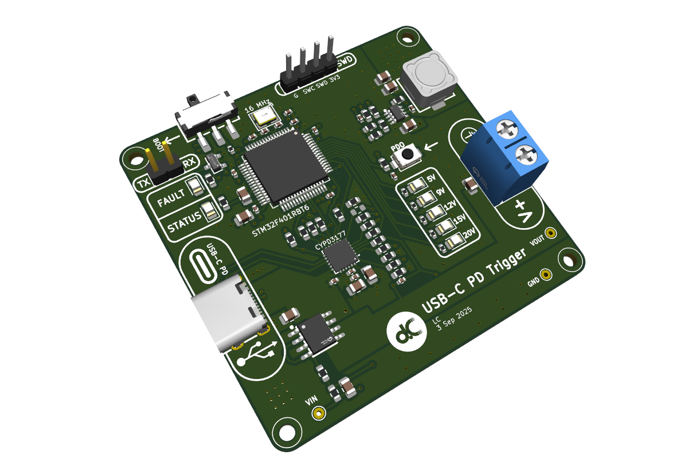

# USB-C PD Trigger Board

## Overview
A custom 4-layer PCB for evaluating and triggering USB-C Power Delivery (PD) voltage profiles.  
The board combines an STM32F401RBT6 microcontroller with a Cypress CYPD3177 PD sink controller, enabling flexible control and monitoring of USB-C PD outputs.

## Features

- **USB-C Input**
  - Receptacle with differential pair routing for DFU support
  - CYPD3177 PD sink controller with I2C interface to MCU
  - Default PDO profile via resistor divider

- **Microcontroller**
  - STM32F401RBT6
  - SWD header for programming/debugging
  - USB DFU capability for easy firmware flashing
  - I2C communication with PD controller

- **User Interface**
  - Single pushbutton to cycle through PDOs
  - 5x yellow indicator LEDs for 5 V, 9 V, 12 V, 15 V, 20 V

- **Connectivity**
  - VOUT terminal block for load connection
  - UART header (TX/RX) for serial monitoring

- **Debug/Monitoring**
  - Testpoints for VIN, VOUT, and GND

## Engineering Notes

- **Stackup:** 4 layers  
  - L1: Signal  
  - L2: Solid GND plane  
  - L3: Power plane  
  - L4: Signal

- **Differential Pair Routing (D+/D−)**
  - ~35 mm trace length  
  - ~0.9 mm mismatch (acceptable for USB Full Speed)  
  - Routed mainly on bottom layer with coplanar GND pour

- **Grounding**
  - Full-plane GND layers with stitching vias for shielding  
  - Top and bottom copper filled with GND pours

## Manufacturing
- Gerbers, BOM, and CPL generated using the [JLCPCB KiCad plugin](https://github.com/Bouni/kicad-jlcpcb-tools)
- Board ready for fabrication via JLCPCB  

## Future Development
- Develop firmware and config scripts for STM32
- Test power delivery with electronic load
- Use USB-C tester to test selected profile
- Add UART command interface for PDO selection  
- Expand to higher-speed USB signaling support
