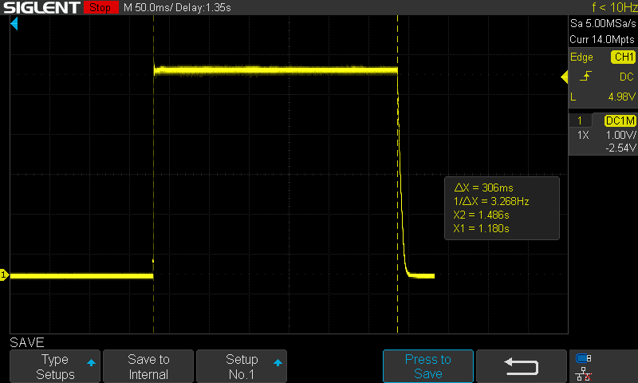

# USB-C PD Trigger Evaluation Board


---

## Overview
A custom 4-layer PCB for evaluating the triggering of various USB-C Power Delivery (PD) voltage profiles over I2C.
The board combines an STM32F401RBT6 microcontroller with a Cypress CYPD3177 PD sink controller, enabling flexible control and monitoring of USB-C PD outputs.


## Features

- **USB-C Input**
  - Receptacle with differential pair routing for DFU support
  - CYPD3177 PD sink controller with I2C interface to MCU
  - Default PDO profile via resistor divider

- **Microcontroller**
  - STM32F401RBT6
  - SWD header for programming/debugging
  - USB DFU capability for easy firmware flashing
  - I2C communication with PD controller

- **User Interface**
  - Single pushbutton to cycle through PDOs
  - 5x yellow indicator LEDs for 5 V, 9 V, 12 V, 15 V, 20 V

- **Connectivity**
  - VOUT terminal block for load connection
  - UART header (TX/RX) for serial monitoring

- **Debug/Monitoring**
  - Testpoints for VIN, VOUT, and GND


## Engineering Notes

- **Stackup:** 4 layers  
  - L1: Signal  
  - L2: Solid GND plane  
  - L3: Power plane  
  - L4: Signal

- **Differential Pair Routing (D+/D−)**
  - ~35 mm trace length  
  - ~0.9 mm mismatch (acceptable for USB Full Speed)  
  - Routed mainly on bottom layer with coplanar GND pour

- **Grounding**
  - Full-plane GND layers with stitching vias for shielding  
  - Top and bottom copper filled with GND pours


## Manufacturing
- Gerbers, BOM, and CPL generated using the [JLCPCB KiCad plugin](https://github.com/Bouni/kicad-jlcpcb-tools)
- Board fabricated and assembled by JLCPCB  


## Bring-Up
Board bring-up required several iterations of firmware and hardware debugging. Key steps and issues encountered are as follows:

- Initial Power & Communication: Testing supply rails and buck converter output voltage. Testing continuity between key nodes. Early tests confirmed basic 5V supply was working using older 'dumb' USB Type-A to C cables.

- Buck Converter Noise Issue: It seems that the reference schematic's inductor was oversized, and also lacked output capacitance. I was able to increase the output capacitance from 9.4uF to 2uF, which decreased pk-pk output ripple from ~650mV to ~150mV, but I was not satisfied with this given the sensitive nature of the electronics.

- Workaround: Desoldered the buck converter and soldered a wire to power VDDD directly from the CYPD3177’s internal regulator.

- Result: Elimiated noisy power supply from list of potential issues.

- Cable & PDO Negotiation Failures: Higher PDOs (>5 V) consistently failed when using e-marked or “smart” USB-C cables. The default 'strapping resistor' voltage was set to 5-15V, with the chip prioritising the higher value. Dumb USB Type-A to C cables would always work and give 5V using basic voltage divider Rp/Rd negotiation, but PD, which requires BMC digital comms, would not. I was even able to select higher PDOs such as 15V using the Kowsi USB-C sniffer device, and plug that voltage into the USB Type-C receptacle on the PCB very carefully as to only engage the VBUS and GND pins. 15V would appear on VIN, but the CYPD3177 naturally would not activate the PMOS load switch to enable VOUT. When I finally plugged the Kowski all the way in, the CC lines made contact, something went astray in the ESD array, and the device shuts off in ~300ms as indicated by the scope trace below.



- After many hours of debugging, the likely suspect was the ESD protection diode on VBUS avalanching at higher voltages (9–20 V), as it is rated for 6V reverse-biased. Fine for 5V, but not 9V or anything greater. I still have my doubts as to weather this was really the issue, as I artifically connected higher voltages to VBUS and it didnt short. Either way, desoldering the ESD array fixed the board's negotiation problems entirely. Correct 300kHz BMC comms can be seen on the CC lines in the scope trace below.


- Result: Successful negotiation of the resistor-strapped PDO, either 15V or 20V by shorting the V_BUS_MAX pin to 3V3.

- Firmware Bring-Up: The strapping resistor combinations provide an immediate PDO, as the CYPD3177 samples the voltage dividers at power-up. However, to have complete flexibility over the requested PDO we require an I2C host to control the CYPD. This is the role of the STM32F401 MCU. Using the [EZ-PD HPI](https://www.infineon.com/assets/row/public/documents/24/44/infineon-ez-pd-tm-bcr-plus-bcr-lite-host-processor-interface-specification-cypd3176-cypd3178-usermanual-en.pdf) (Host Processor Interface) specification, I was able to readthe CYPD's SLIICON_ID over I2C. 


- STM32 HAL routines were then implemented to read the CYPD3177's read-only registers. The data was fed into a nicely formatted buffer and sent to the PC over UART for debugging. The chip's negotiated VBUS (in mV) was accurately reported, and changed from 15V to 20V upon the shorting of V_BUS_MAX to 3V3. Other debug outputs were printed to confirm PD responses, i.e. PD_RESPONSE, CURRENT_PDO, CURRENT_RDO.

- Problem: I was able to read from any register I likey, but could not write/command the chip to select different PDOs. In order to negotiate custom PDO, one must first be able to build the valid 32-bit PDO words themselves, according to the USB PD Rev 3.2 spec. The structure is as follows.


- Using many DEC -> BIN -> HEX conversions all PDOs for 5V, 9V, 12V, 15V and 20V (all at 3A) were developed. Utilising the `union` data-type in C, the 'PDO payload' was built and a function was written to send the 12-byte payload over I2C.

- I had immense issues with this, from endian-ness to spec differences between the CYPD3176, 3178 and missing documentation for the 3177. Additionally, one cannot check (via I2C read) whether the payload was really stored in the correct memory location (starting 0x1800) or not. The CYPD simply outputs a cryptic status code on the PD_RESPONSE register.

- At this stage I thought the 3177 was not PDO write-capable, i.e. its I2C interface is merely for reading registers. However, I found the following GitHub repo [Rutronik CYPD3177 USB PD Control Example](https://github.com/RutronikSystemSolutions/RDK2_USB_Power_Delivery_I2C_Control/tree/master), in which the CYPD3177 is specifically targeted. Ignoring their modbus protocols and PD dev GUI, I dug into the cypd3177.h and cypd3177.c source files to see what they were doing differently. It appeared to be the same as what I was doing, except I was padding the remainder of the PDO payload with zeros, and the memory-write region can supposedly handle up to 7 PDOs with the newer CYPD3176 IC. After translating the Cypress-MCU HAL functions to their STM32 HAL analogs, I was able to use these library functions in my main.c script with functions such as `CYPD3177_ID(uint16_t *id);` and `CYPD3177_VBUS_mV(uint16_t *voltage);`. This seemed to work, as before, in read-only mode. However, to my surprise, when I tested `CYPD3177_ChangePDO(uint32_t *pdo);` with Rutronik's built in PDO1 of 9V @ 2A - it worked! The PCB successfully negotiated 9V from the Baseus PD source and it was verified by the multimeter! The magic function is as follows.

```
HAL_StatusTypeDef CYPD3177_ChangePDO(uint32_t *pdo) {
    union {
        uint8_t  data8[12];
        uint32_t data32[3];
    } pdo_data;

    pdo_data.data32[0] = 0x534E4B50; // "SNKP"
    pdo_data.data32[1] = pdo[0];
    pdo_data.data32[2] = pdo[1];

    if (CYPD3177_Write(CYPD_WRITE_DATA_MEM_REG, pdo_data.data8, sizeof(pdo_data.data8)) != HAL_OK)
        return HAL_ERROR;

    uint8_t mask = 0x03; // Enables, PDO0 amd PD1. Higher voltage => higher priority.
    if (CYPD3177_Write(CYPD_SELECT_SINK_PDO_CMD, &mask, 1) != HAL_OK)
        return HAL_ERROR;

    return HAL_OK;
}
```

- From here, transferred all my pre-computed PDOs and set up a script to change the PDO using `CYPD3177_ChangePDO(uint32_t *pdo);` via a button press (attached to pin PB7) to cycle 5V -> 9V -> 12V -> 15V -> 20V -> 5V. An indicator LED_n illumiated when PDO_n is asserted. Additionally, the STATUS LED illuminates when the CYPD successfully powers on, and the FAULT LED illuminates when the requested PDO cannot be negotiated (for example from a dumb USSB Type-A cable).

- Validation & Testing: used an electronic load to draw current at each PDO and confirm stability. Also tested the source's ablity to cut power when too much current is demanded by the sink. With a 3A current setting, I found the source shut off at about 3.5A. This will vary from source to source, thus motivating the use of an on-board current-sense resistor to trigger CYPD3177 overcurrent shutdown events. The image below shows the board drawing 58W from the Type-C cable, with the indicator LED showing that the device is negotiating 20V.


- Analysed live V_BUS reporting via UART debugging output to verify button pressed result in the desired PDO changed. Incorporated a delay to ensure PDOs cannot change more than once per 100ms. One can see UART messages in reponse to button presses below.

```
>> Requested PDO[0], V=5000 mV
VBUS: 5000 mV
>> Requested PDO[1], V=9000 mV
VBUS: 9000 mV
>> Requested PDO[2], V=12000 mV
VBUS: 12000 mV
>> Requested PDO[3], V=15000 mV
VBUS: 14900 mV
>> Requested PDO[4], V=20000 mV
VBUS: 19900 mV

```

- Confirmed stable long-duration operation at all available PDOs. Note that the integrated Dual PMOS is not ideal due to the higher R_DS(on). In the next revision, I will use discrete MOSFETs with lower R_DS(on) and better thermal performace. 3A loads can cause excessive heating of the dual-PMOS package.

## Future Development

With this project's successful conclusion, I will now move towards incorporating a buck-boost CCCV charger such that the system can appropriately and safely charge Li-ion batteries from a variety of USB PD sources.
